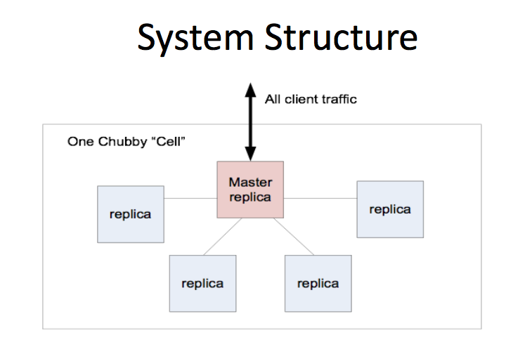

# The Chubby lock service for loosely-coupled distributed systems

* [The Paper](http://static.googleusercontent.com/media/research.google.com/en/us/archive/chubby-osdi06.pdf)
* [Papers We Love (Video by Camille)](https://www.youtube.com/watch?v=PqItueBaiRg)

Below are my notes from reading the paper.

## Chubby Lock Serice
Chubby lock solves distributed consensus using asynchronous communication using Paxos at its core.

It allows clients to:
- synchronize activies
- agree on basic info about their environment

It solves the distributed consensus problem of the election of a primary among peers using asynchronous communication.

## System Structure

### Chubby Cell 

* Image from [Camille's slides](https://speakerd.s3.amazonaws.com/presentations/1c13da90525401327aec02fb58ce8c77/skamille_slides.pdf)

- serves 10K 4-processor boxes connected with 1GBit ethernet.
- most cells are confined to a single data centre
- typically 5 (or odd num) known as replicas
- placed to reduce correlated failures (eg. in different racks)
- replicas use a distributed concensus protocol to elect a master. Master must obtain votes from a majority of the replicas eg 3 of 5.
- the elected master has a `master lease` which is an interval where no new master can be elected. It can be renewed by majority vote.
- replicas have a copy of a simple database but reads are writes are initiated only by the master. Replicas copy updates from the master using the consensus protocol.

### Client to Master Communication
Clients find the master by sending master location requests to the replicas listed in the DNS. Non master replicas resond to these requests and return the identity of the master.

The client sends all requests to the master until it either stops responding or indicates that it is no longer the master.

#### Read and Write Requests
Write requests are propogated via the consensus protocol to all replicas. These requests are acknowledged when the write has reached a majority of the replicas in the cell.

Read requests are satisfied only by the master.

### Replica Failure
When a replica has failed and not recovered for a few hours, a replacement systems selects a new box from a pool. The replacement system also updates the DNS tables, replacing the IP address of the failed replica with the that of the new one.

The master periodically polls the DNS and will pick up the change. The master then updates the cell members list  which is kept consistent across all members via the normal replication protocol.

### Coarse-grained locks
- An app might use a lock to elect a primary which would then handle all acess to that data for hours or days as opposed to fine-grained locks which hold access for seconds.
- coarse-grained locks impose less load on the lock server

## Files, directories, and handles
- Chubby exports a file system interface that is like UNIX but simpler. eg: `/ls/foo/wombat/pouch`
- `ls` = lock service
- `foo` is the name of the Chubby cell. This is resolved to one or more Chubby servers via DNS lookup
- `wombat/pouch` is interpreted within the named Chubby cell
- each directory contains a list of child files and directories
- each file contains a sequence of uninterpreted bytes
- the name space contains only files and directories collectively called `nodes`.
- `ephemeral` nodes are deleted if no client has them open
- clients open nodes to obtain `handles` - these are like UNIX file descriptors

## Locks and sequencers

## Supporting technologies
### Paxos (from wikipedia)
Paxos is a family of protocols for solving consensus in a network of unreliable processors. Consensus is the process of agreeing on one result among a group of participants. This problem becomes difficult when the participants or their communication medium may experience failures.

### Remote Procedue Calls (RPC)
The notion of calling a procedure that does not exist in the same address space. The two processes might be on the same system or on different systems connected by a network. 

Using RPC allows the user to avoid the deatils of the interface with the network.

RPC spans the Transport and Application layers of the OSI model of network communication.

Sequence of events during an RPC (from wikipedia)
1. The client calls the client stub. The call is a local procedure call, with parameters pushed on to the stack in the normal way.
1. The client stub packs the parameters into a message and makes a system call to send the message. Packing the parameters is called marshalling.
1. The client's local operating system sends the message from the client machine to the server machine.
1. The local operating system on the server machine passes the incoming packets to the server stub.
1. The server stub unpacks the parameters from the message. Unpacking the parameters is called unmarshalling.
1. Finally, the server stub calls the server procedure. The reply traces the same steps in the reverse direction.